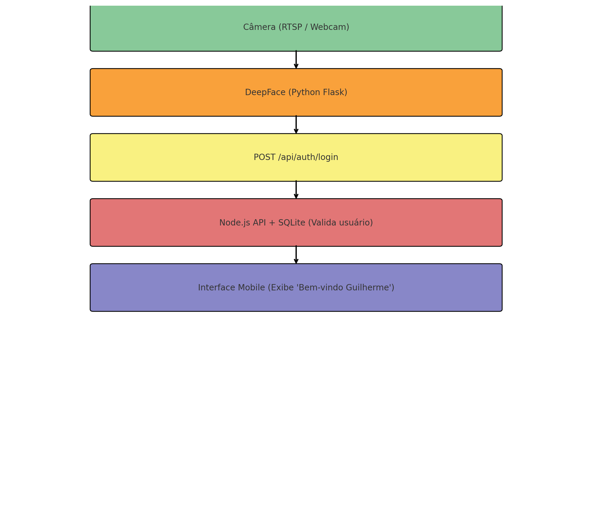

# 🔐 Login Facial Integrado com Node.js

## 👥 Integrantes

- **Enricco Rossi de Souza Carvalho Miranda** – RM551717  
- **Gabriel Marquez Trevisan** – RM99227  
- **Guilherme Silva dos Santos** – RM551168  
- **Samuel Ramos de Almeida** – RM99134  
- **Laura Claro Mathias** – RM98747  

---

## 🚀 Descrição

Este projeto demonstra a integração entre um sistema de **reconhecimento facial (Python + DeepFace)** e uma **aplicação principal em Node.js**.  
A autenticação é realizada por meio do reconhecimento facial, **sem necessidade de senha**.  

O objetivo é aplicar o reconhecimento facial de forma prática dentro de um caso real de uso — neste caso, **login automático na aplicação principal**.

---

## 📚 Índice

- [Arquitetura](#️arquitetura)
- [Tecnologias Utilizadas](#-tecnologias-utilizadas)
- [Como Rodar o Projeto](#️-como-rodar-o-projeto)
- [Exemplo em Vídeo](#-vídeo-explicativo)
- [Funcionalidades](#-funcionalidades)
- [Configuração](#-configuração)
- [Documentação](#-documentação)
- [Problemas Conhecidos / Solução de Problemas](#-problemas-conhecidos--solução-de-problemas)

---

## ⚙️ Arquitetura

1. O módulo Python captura a imagem da **webcam**.  
2. O **DeepFace** identifica se o rosto é autorizado.  
3. Quando reconhecido, o sistema envia automaticamente um **POST** para o endpoint `/api/auth/login` do backend Node.js.  
4. O **Node.js** autentica o usuário no **SQLite** e retorna um **token JWT**.

---

### 🧠 Diagrama da Integração



---

## 🧩 Tecnologias Utilizadas

### 🔹 Backend Principal
- **Node.js** – API REST principal  
- **Express** – framework para criação de rotas  
- **JWT** – autenticação por token  
- **SQLite** – banco de dados leve para persistência  

### 🔹 Módulo de Reconhecimento Facial
- **Python** – processamento da imagem  
- **Flask** – servidor auxiliar (caso necessário)  
- **DeepFace** – modelo de reconhecimento facial  
- **OpenCV** – captura e manipulação de vídeo/imagem  

### 🔹 Hardware
- **Câmera RTSP ou Webcam local**

---

## ▶️ Como Rodar o Projeto

### 1️⃣ Backend Node.js

```bash
cd backend
npm install
npm start
```

A API será executada em:

```
http://localhost:3000
```

### 2️⃣ Módulo de Reconhecimento Facial (Python)

```bash
cd reconhecimento-facial
# Ativar ambiente virtual (Windows)
venv\Scripts\activate
# Instalar dependências (se necessário)
pip install -r requirements.txt
# Executar o sistema
py main.py
```

Servidor Python será iniciado em:

```
http://127.0.0.1:5000
```

---

## 🎥 Vídeo Explicativo

Demonstração disponível no YouTube:  
👉 [Acessar vídeo de demonstração](URL_doYOUTUBE)

---

## ✨ Funcionalidades

- Autenticação via reconhecimento facial
- Comunicação entre Python e Node.js via HTTP
- Emissão de token JWT para sessões autenticadas
- Interface leve e simples para testes
- Armazenamento de usuários com SQLite

---

## ⚙️ Configuração

Antes de executar o projeto:

- Verifique se a câmera está conectada corretamente.
- Certifique-se de que o Python esteja na versão 3.8+.
- Configure corretamente os arquivos `.env` no backend (se aplicável) com as variáveis de ambiente como:

```env
JWT_SECRET=seusegredoaqui
PORT=3000
```

---

## 🧾 Documentação

- **/api/auth/login** – Endpoint para autenticação com base em dados recebidos do Python  
- **/api/users** – Cadastro e listagem de usuários  

---

## 🛠️ Problemas Conhecidos / Solução de Problemas

- ❌ **Problema:** Câmera não detectada  
  ✅ **Solução:** Verifique as permissões de acesso e o driver da câmera  

- ❌ **Problema:** DeepFace falha na comparação  
  ✅ **Solução:** Certifique-se de que o rosto esteja bem iluminado e centralizado  

- ❌ **Problema:** Erro de conexão entre Python e Node.js  
  ✅ **Solução:** Confirme se ambos os servidores estão rodando e escutando nas portas corretas

---

